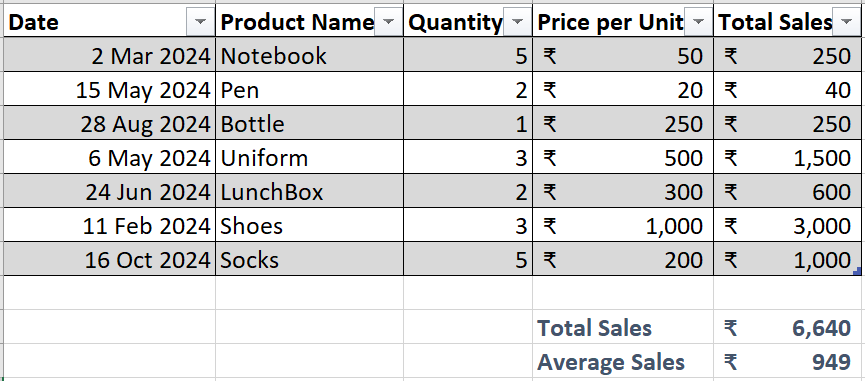

# Basic Sales Tracker 

This project is part of the Data Science Mastermind program. It demonstrates how to create a sales tracker in Excel with the following features:  
- Calculating total and average sales.  
- Formatting and styling data for readability.  
- Using basic formulas like `SUM`, `AVERAGE`, and `*`.  

## Methodology  
1. Data Setup: Entered sample sales data with columns - Date, Product Name, Quantity, Price per Unit.  
2. Calculations: Used formulas to calculate Total Sales, Total Amount, and Average Sales.  
3. Formatting: Applied date and currency formats, and styled the table.  
4. Summary: Created total and average sales summaries.  
 

## Tools Used  
- Microsoft Excel  
- GitHub for version control.  
